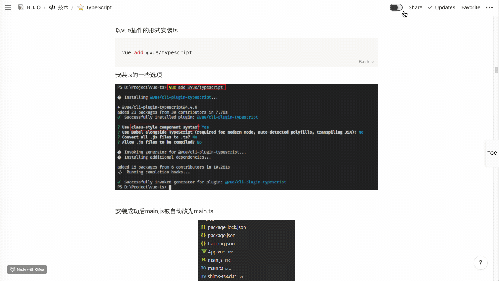

# Notion-Chrome-Toc-Extension
Notion Chrome插件
- 自动生成文章toc侧边栏（因为官方没这个功能，写长文的时候拉滚动条很痛苦，做一个临时用，做的很粗略有问题请提issue）
- 暗黑模式（提醒：官方有暗黑模式ctrl+shift+L即可，插件内的视觉对比度较低，看个人喜好选择）



## 使用方法
- chrome打开开发者模式导入整个包使用
- 导入`/dist`目录下的`crx`文件使用

(代码写的很烂改天有空再重构)

```javascript
// ==UserScript==
// @name         Notion Fixed TOC
// @name:zh-CN   Notion 浮动 TOC
// @namespace    https://notion.cx/
// @version      0.2.0
// @description  Make Notion TOC Fixed.
// @description:zh-cn 让 Notion 的 TOC 浮动显示。
// @author       Ruter Lü
// @match        https://www.notion.so/*
// @grant        none
// ==/UserScript==

(function() {
    'use strict';

    /* Helper function to wait for the element ready */
    const waitFor = (...selectors) => new Promise(resolve => {
        const delay = 500;
        const f = () => {
            const elements = selectors.map(selector => document.querySelector(selector));
            if (elements.every(element => element != null)) {
                resolve(elements);
            } else {
                setTimeout(f, delay);
            }
        }
        f();
    });
    /* Helper function to wait for the element ready */

    let callback = function(mutations) {
        waitFor('.notion-table_of_contents-block').then(([el]) => {
            const toc = document.querySelector('.notion-table_of_contents-block');
            if (toc) {
                const toc_p = toc.parentElement;
                if (!toc_p.classList.contains('notion-column-block')) {
                    return;
                }
                toc_p.style.position = 'sticky';
                toc_p.style.top = '0';
                toc_p.style.overflowY = 'scroll';
                toc_p.style.maxHeight = '50vh';
            }
        });
    };
    const observer = new MutationObserver(callback);
    let notionApp = document.getElementById('notion-app');
    const config = { childList: true, subtree: true };
    observer.observe(notionApp, config);
})();
```
